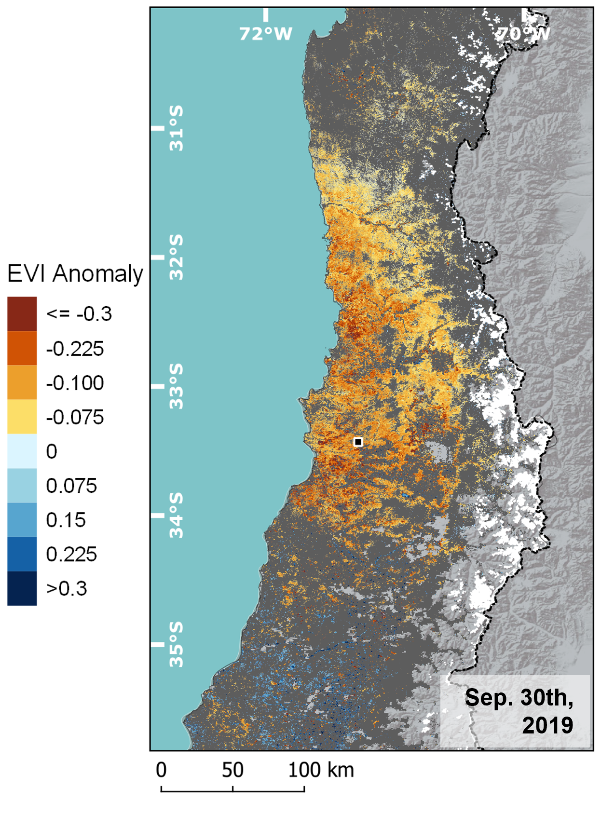
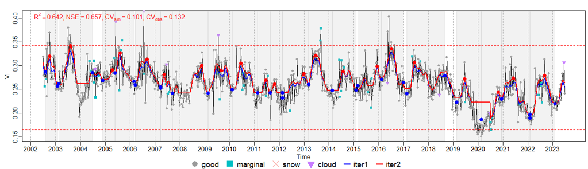
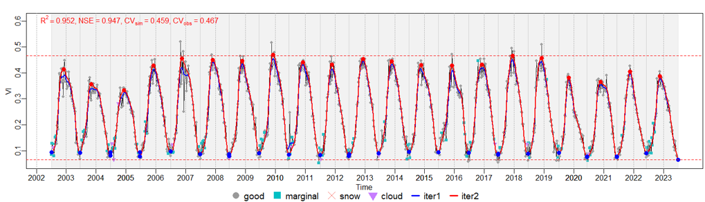
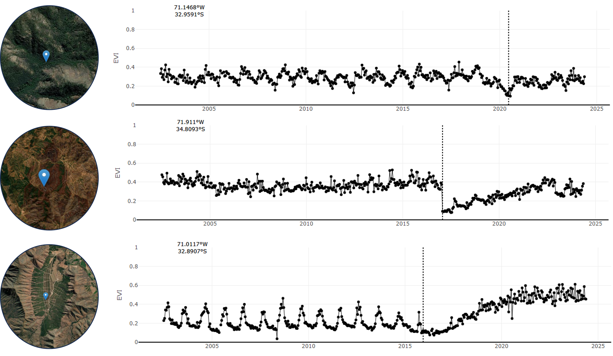

---
output:
  xaringan::moon_reader:
    #self_contained: true
    css: xaringan-themer.css
    nature:
      slideNumberFormat: "%current%"
      highlightStyle: zenburn
      highlightLines: true
      ratio: 16:9
      countIncrementalSlides: true
      titleSlideClass: [left, bottom]
  seal: false
---
class: inverse,left, middle
background-image: url(background.png)
background-size: contain


```{r setup, include=FALSE}
options(htmltools.dir.version = FALSE)
pacman::p_load(tidyverse, sf, terra, scales, phenofit, npphen, leaflet, plotly, htmlwidgets, widgetframe, DiagrammeR)

knitr::opts_chunk$set(
  fig.width=9, fig.height = 6, fig.retina=1.5,
  out.width = "99%",
  cache = FALSE,
  echo = TRUE,
  message = FALSE, 
  warning = FALSE,
  hiline = TRUE
)

sitios <- read_sf('c:/github/tseries_sample/shp_data/pre_selected_modis_centroides.gpkg')
modis <- read_sf('c:/github/tseries_sample/shp_data/20240212_MODIS_ts_sample_px.gpkg') %>% st_drop_geometry()
landsat <- read_sf('c:/github/tseries_sample/shp_data/20240212_Landsat_median_ts_sample_px.gpkg') %>% st_drop_geometry()
central_chile <- read_sf('c:/github/spatial_heterogenety/shp/test_extent.gpkg')
# .footnote[
# .large[<a href="http://github.com/JoseLastra">
# <span style="color:#D7D7D7">Github: JoseLastra</span> </a><br>
# <a href="mailto:jose.lastramunoz@wur.nl"> <span style="color:#D7D7D7">jose.lastramunoz@wur.nl</span></a><br>]
# ] <br>
  
```


---
## Central-South Chile


.pull-left[
- Extension 30°S - 43°S
- High endemism region and biodiversity hotspot (Myers et al., 2000; Urrutia-Jalabert et al., 2018; Henríquez, 2019)
- More frequent and intense disturbance events (fires, droughts, antrophogenic pressures, etc.)
- Recent hyper-drought affected ~90% of natural vegetation with a strong decrease in productivity (Chavez et al., 2020; Miranda et al., 2023)
]

.pull-right[
<center></center>
]


---
## Phenological assesment

- Several temporal behaviors, densities, structures and changes.

.left-column[

```{r echo=F, warning=F,fig.height=6.25}
display_data <- sitios[c(5,7),] %>% st_transform(4326) 
extension <- st_transform(central_chile, 4326)
bbx <- st_bbox(extension) %>% as.numeric()

leaflet() %>% addProviderTiles(providers$GeoportailFrance.orthos, group = 'GeoportailFrance') %>% 
  addProviderTiles(providers$Esri.WorldImagery, group = 'Esri Imagery') %>% 
  fitBounds(lng1 = bbx[1], lat1 = bbx[2], lng2 = bbx[3], lat2 = bbx[4]) %>% 
  addPolygons(data = extension, fillOpacity = 0, color = 'white', group = 'limits') %>%  
  addCircles(data = display_data, color = 'red', label = ~DESCRIPTOR, radius = 15, group = 'Sample ts') %>% 
  addLayersControl(baseGroups = c('Esri Imagery', 'GeoportailFrance'), overlayGroups = c('limits', 'Sample ts'))
```

]

.right-column[
```{r echo = F}
display_landsat <- landsat %>% filter(ID_px %in% c(5,7) & between(Time, ymd('2002-07-01'), ymd('2023-06-30'))) %>%
  mutate(EVI = Value)

g <- display_landsat %>% ggplot(aes(x = Time, y = EVI)) + geom_line() + geom_point(size = 1) + ylim(0,0.55) + 
  facet_wrap(~DESCRIPTOR_CBN, nrow = 2) + scale_x_date(date_breaks = '2 years', date_labels = '%Y') +
  theme_bw()

widgetframe::frameWidget(plotly::ggplotly(g), width = '99%', height = '95%')

```
]
---
## Phenological assesment

--
- Traditional approaches do not work properly in every scenario (Broich et al., 2015; White et al., 2009)
- This produces not reliable metrics or no metrics at all.

<center></center>
<center></center>

---
## Issues

--
- Lack of seasonal behavior, noisy signals among others affect the quality of smoothed signals.
- Disturbances such as fires, drought and land cover changes. 

<center></center>


---
## Approach

.left-column[
- Detect seasonality: Amplitudes per year
- Austral summer peak: November, December, January and February
- Dynamic GS and curve adaptation

]

.right-column[
```{r echo=F, fig.align='center', fig.height=7}
 source('charts/01_lsp_model_conv.R')
 a
```
]

---
## Main questions


---
## Main issues until now

---
## Possible journals

--- 
## Feedback 


---
class: inverse,left, middle
background-image: url(background.png)
background-size: contain


